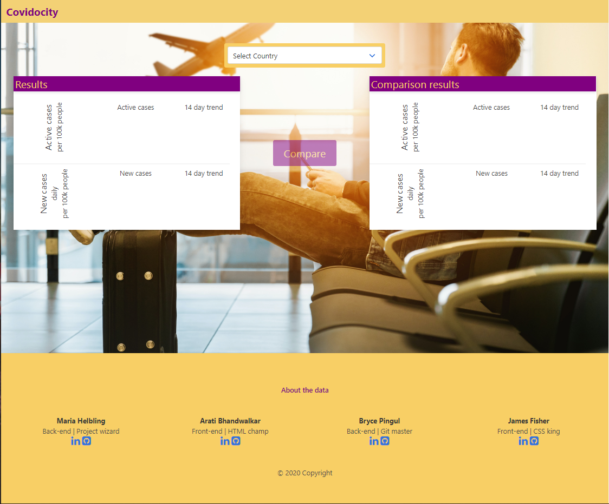

# Covidocity - quick risk assesment site

As the world re-opens and people start to move about again, our travel decisions should be informed. We are here to help. This is a site showing a quick overview of travel destinations' COVID situation, condenced into 4 key numbers.

[A deployed version can be viewed here.](https://maria-helbling.github.io/travel-risk-2020/)

## Contents

1. [About](#about)
    1. [User Story](#user%20story)
    2. [Acceptance criteria](#acceptance%20criteria)
    3. [Data](#data)
    4. [Build](#build)
    5. [Future plans](#future%20plans)
2. [Setup](#setup)
3. [Credits](#credits)
4. [License](#license)
5. [Contributing](#contributing)

## About

This is a one page site showing quick view stats on travel destinations and allowing the user to compare those stats.

### User Story

    AS A traveler  
    I WANT to see the COVID situation data on my destination  
    SO THAT I can plan a trip accordingly  

### Acceptance Criteria

    GIVEN a data dashboard with destination inputs  
    WHEN I search for a country or US state  
    THEN I am presented with current and trend data on that destination  
    WHEN I view current and trend data on that destination  
    THEN I am presented with the latest number of new cases per 100k people per day, latest number of active cases per 100k people, 14 day trends on each  
    WHEN I view the trend  
    THEN I am presented with a graphical representation of the 14 day data  
    WHEN I click the 'Compare' button  
    THEN I can search a second destination without losing the data on the first destination  
    WHEN I search for the second destination  
    THEN I am again presented with the data points as above in a new comparison container  


The page loads with a large hero element and site name. That is followed by the input fields and results boxes ready to populate.



There are two results cards for ease of comparison. The results cards indicate the trend values by color. Green for improving, red for worsening and gold for plateauing.


We also offer an about page with info on the calculations and sources of the data.


### Data

The application uses the following data inputs:
* COVID new cases per day and total active cases. This information is available for countries as well as US states through the [COVID-19 Data Repository by the Center for Systems Science and Engineering (CSSE)](https://github.com/CSSEGISandData/COVID-19) at Johns Hopkins University. [Documentation](https://covid-api.com/api/) can be found here.
* Population data for the countries of the World is retreived through Opendatasoft and the source is the [World Bank](http://databank.worldbank.org/data/reports.aspx?source=2&series=SP.POP.TOTL&country=#). [Documentation](https://data.opendatasoft.com/explore/dataset/world-population%40kapsarc/api/?disjunctive.country_name&q=united+states&refine.year=2018) can be found here.
* Population data for US states is retreived through [US Census Bureau](https://www.census.gov/data/developers.html). [Documentation](https://www.census.gov/data/developers/data-sets/popest-popproj/popest.Vintage_2019.html) can be found here. 

Based on the inputs we calculate the following:
* new cases per day per 100k people
* active cases per 100k people
* trend for each based on last 14 days

### Build

* In HTML semantic tags have been used to aid with accessibility.
* The site is built using Bulma CSS framework.
   * The use of Bulma minimises the need for media queries. 
   * See [Bulma documentation](https://bulma.io/documentation/) for customising the site with their provided options
* [countries.js](https://github.com/IshanDemon/List_Country_State) is used to populate the drop-down menues
* [jQuery](https://api.jquery.com/) powers the dynamic rendering of the html content based on user input
* [charts.js](http://www.shilling.co.uk/survey/Charts/docs/#:~:text=Chart.js%20Documentation%201%20Getting%20started.%20Include%20Chart.js%20First,7%20Doughnut%20chart.%20...%208%20General%20issues.%20) is used for the charts rendered for trend line illustration
* [moment.js](https://momentjs.com/) is used to manipulate date values for historic data extraction from APIs
* FontAwesome is used for social media links. [Read more about fontAwesome use and installation here.](https://fontawesome.com/how-to-use/on-the-web/referencing-icons/basic-use)


### Future plans

- [ ] search history storage
- [ ] render first info based on browser location
- [ ] badges on numbers for further info on calculation
- [ ] when comparing, graphs switch to x axis and y axis crossing at zero

## Setup

To clone the repo:
```
git clone https://github.com/maria-helbling/travel-risk-2020.git
``` 

## Credits

@Arati15 Arati Bhandwalkar: front-end, html ruler
@jfisher396 James Fisher: front-end, Bulma king
@mariah-helbling Maria Helbling: back-end, algorithms, project champ
@Brycetp11 Bryce Pingul: back-end, ajax requests, git master

## License

Built by Arati Bhandawalkar, James Fisher, Maria Helbling & Bryce Pingul
This application is released under [MIT](assets/LICENSE.txt) license.

## Contributing

To contribute to this application, create a pull request.
Here are the steps needed for doing that:
- Fork the repo
- Create a feature branch (git checkout -b NAME-HERE)
- Commit your new feature (git commit -m 'Add some feature')
- Push your branch (git push)
- Create a new Pull Request

Following a code review, your feature will be merged.

